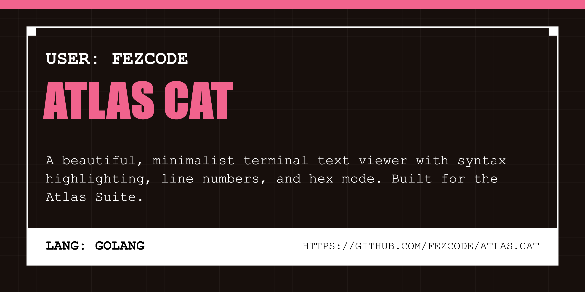

# atlas.cat 🐈

A beautiful, high-performance terminal text viewer with syntax highlighting and line numbers. Built with Go and the Atlas Suite philosophy.



## Overview

`atlas.cat` is a minimalist alternative to `cat` or `bat`, designed to provide high-fidelity syntax highlighting and a smooth TUI paging experience within the terminal.

## Features

- **Syntax Highlighting:** Powered by [Chroma](https://github.com/alecthomas/chroma) for 200+ languages.
- **Interactive Paging:** Smooth scrolling, searching, and window management via Bubble Tea.
- **Dual Mode:** Seamlessly switch between interactive TUI and direct stdout output.
- **Minimalist:** Fast, dependency-light, and keyboard-centric.

## Installation

```bash
gobake build
```

## Usage

```bash
# Open file in interactive TUI
atlas.cat main.go

# Output highlighted text directly to terminal
atlas.cat -n main.go

# Show version
atlas.cat -v
```

## TUI Controls

- **j, down:** Scroll down
- **k, up:** Scroll up
- **f, page down:** Page down
- **b, page up:** Page up
- **q, esc:** Quit
